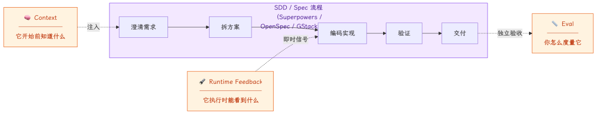
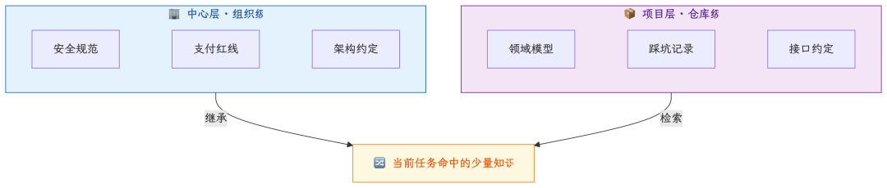
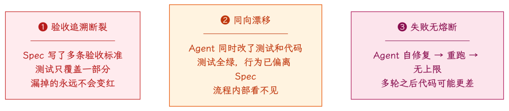
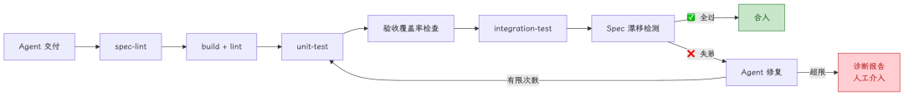

> 原文链接: https://mp.weixin.qq.com/s/KxIoaLBYnHoEqGSn2uKxFQ
> 来源: dolphin07
> 抓取日期: 2026-06-25

---

团队上 Superpowers 一段时间后，反馈开始分化：流程更规整了，低级问题少了一些，但效率没有像预期那样明显提升。核心骨干的感受很一致：质量在变稳，速度却没有同步变快，复杂场景甚至更慢。

复盘一周，结论不是 Superpowers 的问题。OpenSpec、GStack、Kiro 这类工具，本质上都是在把 Spec 流程标准化。但 **Spec 流程落地，不等于 Agent 就能稳定交付**。

中间差的，是三类工程供给：Agent 开始前有没有足够的 **Context**，交付后有没有独立的 **Eval**，写代码时有没有即时的 **Runtime Feedback**。

如果说前几篇讲的是“如何写出一份更好的 Spec”，这一篇要往前走一步：**Spec 只是起点，真正能让它持续生效的，是围绕 Spec 建起来的工程 Harness。**

---

## 一、SDD 流程落地了，为什么产出还上不去？

> **Spec 流程是发动机。Context 是燃油，Eval 是质检，Runtime Feedback 是仪表盘。三缺一跑不远。**

---

## 二、Context：Agent 开始前是否知道系统约束

需求澄清解决“你想要什么”。**但它不解决“你的系统里有什么约束”。**

真实场景：Brainstorm 问了“扣费的锁粒度”，同事答“用户 + 业务维度”。Agent 生成了方案——技术正确，但违反了一条业务规则：**余额变更必须先建单再扣减，不能直接操作余额。** 这条规则来自三年前一次重复扣费事故的复盘，写在内部 wiki 里，不在代码里，也不在注释里。

同事没提，因为对他来说这是常识。**隐性知识的特征，就是持有者不觉得它需要被说出来。**

### 上下文知识：最难做对的一环

这里最容易犯的错，是把 Context 当成“知识库”。好像只要把 wiki、规范、事故复盘、接口文档都塞给 Agent，它就会变聪明。

事实相反。**对 Agent 来说，Context 不是资料库，而是本次任务的燃料。** 燃料不纯，发动机不会更强，只会抖。

这也是上下文知识最难做对的地方：不是写得越多越好，而是要在正确时间，把正确的几条约束交给 Agent。

#### 1. 注入越多，效果未必越好

Context Window 不是垃圾桶。规则塞得越多，Agent 未必越稳。原因是 **Attention 稀释**：无关信息会把真正关键的约束“挤”出有效注意力区域。

做扣费需求时，Agent 不需要整套支付 wiki。它真正需要的是几条硬约束：先建单再扣减、失败状态怎么落、幂等键怎么生成、哪些操作不能绕过资产服务。

这就是 Context 和文档的区别：**文档追求完整，Context 追求命中。** 上下文工程的核心问题不是“怎么写更多知识”，而是怎么命中当前任务最需要的几条。

#### 2. 项目知识和中心知识必须分层联动

只有组织级红线，代码容易“规范正确但不适配本项目”。只有项目级约束，安全红线又会散落各处，新项目从零踩坑。两层混在一起，则会膨胀失控，最后谁也检索不准。

更稳的模型是**继承 + 覆写**：组织层维护不可突破的红线，项目层维护仓库里的领域约束。Agent 看到的是合并后的少量知识；发生冲突时，项目层可以覆盖，但必须留下原因和 owner。

#### 3. 知识的真正难题是保鲜

写入第一批知识很容易。难的是三个月后：代码重构了，规则还是旧的；接口废弃了，知识库还在推荐。

没有知识，Agent 至少会暴露不确定。**过期知识比没有知识更危险——它会让 Agent 自信地犯错。**

所以知识条目不能只是自然语言笔记，至少要带三类元信息：**出处、owner、失效条件**。

* • 出处：来自代码、测试、接口契约、事故复盘，还是决策记录
* • owner：谁能确认这条规则还成立
* • 失效条件：哪些代码、接口或契约变更后，它必须被复核

代码索引只能解决“找得到”，不能解决“还对不对”。代码说明系统现在怎么跑，测试和契约说明它承诺什么行为，事故复盘和决策记录说明为什么必须这样做。真正有价值的 Context，是把这些东西连起来。

如果只做第一步，就给关键知识加三列：`来源`、`owner`、`关联代码/契约`。以后相关代码变更时，这条知识自动进入待复核。Agent 可以辅助生成和整理知识，但最终要由 owner 校准。

---

## 三、Eval：交付后必须有独立验收

Context 守输入，Eval 守输出。Spec 流程末端通常都有验证，但结构性问题是：**生成代码和验证代码的，常常还是同一个 Agent。考生批改自己的试卷，分数不可信。**

三个缺口：

### 独立闸门：别让生成者批改自己的答案

Agent 交付**之后**加一层独立验证。核心原则：**闸门的判定逻辑不能由被检查的 Agent 修改。**

**闸门 1：验收覆盖率。** 清点 Spec 每条验收标准是否有对应测试。两个模式：`shallow` 做命名匹配，适合 CI 常跑；`deep` 用 LLM 语义比对断言是否真的在验证标准描述的行为。为什么要 deep？Agent 擅长“命名对齐”：测试叫 `test_idempotency`，但只断言返回码 200，没验证重复请求是否真的幂等。

**闸门 2：Spec 漂移检测。** 结构层做确定性检查，如接口签名、字段完整性、约束条件；语义层用 LLM 判断软约束，如“失败时应优雅降级”。**前提：Spec 在编码前冻结。** Agent 不能一边写代码一边改 Spec，否则检测失去基准线。

**闸门 3：失败熔断。** Agent 连续自修复时，很容易从“修一个点”变成“重写一大片”。所以需要明确终止条件：超过有限次数后暂停，输出诊断报告，必要时回滚到最近全绿状态，让人介入判断。

---

## 四、Runtime Feedback：Agent 写代码时能不能看到现场

Context 解决“开始前知道什么”，Eval 解决“交付后怎么验”。但写代码的过程中，Agent 还需要另一类供给：**环境给它的即时信号。**

> **没有 Runtime Feedback 的 Agent 是闭眼开车。Context 告诉它路线图，Eval 事后告诉它撞了，但开车过程中它看不见路。**

业务团队的真实现状是：本地环境起不来、起来了没数据、外部依赖 mock 不掉、日志不可读。**多数团队的瓶颈不在 Spec 流程，而在这里。**

拆成两件事：

**① 可运行的环境**——Agent 一条命令能跑起来：

| 要素 | ✅ 达标 | ❌ 不达标 |
| --- | --- | --- |
| 启动 | `make dev` 一键拉起 | 手动改 3 个配置 + 启 5 个依赖 |
| 数据 | 起来即有测试账号和订单 | 空库，人工造数据半小时 |
| 依赖 | 关键依赖有 mock、沙箱或可重放样本 | 必须连真实第三方 |
| 日志 | 结构化 JSON + request id | printf 自由格式 |

**② 关键路径冒烟测试**——不追覆盖率，把业务命脉做成一组**快、稳定、本地可跑**的测试：

* • 覆盖率不高，但下单、支付、登录这些核心链路可自动验证，价值远胜“数字好看但关键路径靠人肉点”
* • 零 flaky。不稳定测试是负信号，比没有测试更差
* • 失败信息直接指向断点，不需要人翻日志

**判断标准**：Agent 改完一段下单逻辑，能否自己跑完“起环境 → 造单 → 看断言 → 确认通过”？能，就是有 Runtime Feedback。要等你部署到测试环境人肉验证，就是没有。

### 旧工程债，会直接变成 AI 债

一键启动、种子数据、结构化日志——AI 之前就该有。但视角要换：以前是加分项，现在是 Agent 能否自主工作的**前提条件**。

教训：Agent 写了完整单测全绿，但支付扣费走的是过薄 mock，实际对接时调用参数顺序和真实 SDK 不一致，联调才暴露。

后来我们开始补更接近真实依赖的沙箱样本和回放用例。录制回放不是所有业务都能低成本做到，但至少要避免“永远返回成功”的薄 mock。

**Mock 可以用，但不能薄到只证明想象中的世界成立。Runtime Feedback 的价值，在于把真实约束尽早暴露出来。**

---

## 五、从 SDD 到 Harness：让 Spec 持续生效

补齐这三类工程供给，效率改善才有可能发生。也正是在这里，SDD 开始从“写 Spec 的方法”升级成“让 Spec 持续生效的 Harness”。但目前它仍然是“人驱动”：你手动触发知识检索、手动跑测试、手动检查覆盖率。

下一个问题：**能不能让这些能力自动运转，形成不需要人盯的闭环？**

这就是 **Loop Engineering**——不再由人 prompt Agent，而是设计一套系统来 prompt Agent。Boris Cherny（Anthropic Claude Code 负责人）也表达过类似意思：他现在更关注让系统自己组织 prompt，而不是手写每一次 prompt。

没有 Context 的 Loop 每次都猜；没有 Runtime Feedback 的 Loop 闭眼跑；没有 Eval 的 Loop 不知道自己在收敛还是发散。**先补供给，再建 Loop——顺序不能反。**

*你的仓库，Agent 能一条命令跑起来吗？*

---

*下一篇预告：**09-three-stages** — Loop Engineering：为什么你的 Agent 跑不起循环？*
